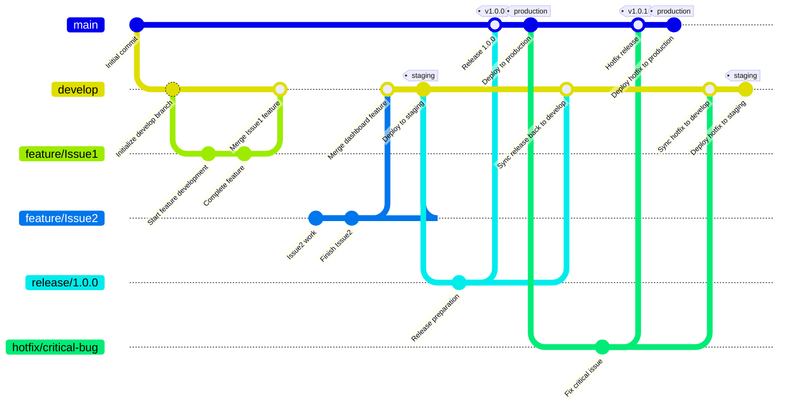

# Git Branching Strategy

## Overview

This document outlines our Git branching strategy for managing staging and production deployments. It provides guidelines for branch management, feature development, releases, and hotfixes.

Our strategy is designed to support:
- Bi-weekly/tri-weekly production deployments
- A stable staging environment for front-end testing
- Efficient workflow for a small backend team 
- Integration with existing Concourse CI/CD pipelines

## Core Branches

Our repository maintains the following permanent branches:

- **`main`**: The production branch that represents what is currently in production.
- **`develop`**: The development branch where features are integrated for testing in staging environments.

## Feature Development

When implementing a new feature:

1. Create a feature branch from `develop` branch:
   ```
   git checkout develop
   git checkout -b feature/feature-name
   ```

2. Develop the feature in the feature branch.

3. When the feature is complete, create a pull request to merge back into `develop`.

4. After code review and approval, merge the feature branch into `develop`:
   ```
   git checkout develop
   git merge --no-ff feature/feature-name
   git push origin develop
   ```

5. The `develop` branch is automatically deployed to the staging environment for testing.

**Important**: The `develop` branch serves as our stable staging environment. Front-end developers rely on this environment for testing their code against our APIs. Therefore:
- Ensure feature branches are reasonably complete and tested before merging to `develop`
- Coordinate significant changes to `develop` with the front-end team
- Prioritize stability of the staging environment

## Release Management

When preparing a release:

1. Create a release branch from `develop` when all features for the release are complete:
   ```
   git checkout develop
   git checkout -b release/X.Y.Z
   ```

2. Fix any release-specific issues directly in the release branch.

3. When the release is ready, merge the release branch into both `main` and `develop`:
   ```
   git checkout main
   git merge --no-ff release/X.Y.Z
   git tag -a vX.Y.Z
   git push origin main --tags
   
   git checkout develop
   git merge --no-ff release/X.Y.Z
   git push origin develop
   ```

4. The `main` branch is automatically deployed to the production environment.

## Hotfix Process

For urgent fixes that need to go directly to production:

1. Create a hotfix branch from `main`:
   ```
   git checkout main
   git checkout -b hotfix/issue-description
   ```

2. Implement the fix in the hotfix branch.

3. Run thorough testing on the hotfix to ensure it addresses the issue without introducing new problems.

4. When the fix is complete, merge the hotfix branch into both `main` and `develop`:
   ```
   git checkout main
   git merge --no-ff hotfix/issue-description
   git tag -a vX.Y.Z+1
   git push origin main --tags
   
   git checkout develop
   git merge --no-ff hotfix/issue-description
   git push origin develop
   ```

5. The Concourse production pipeline will automatically deploy the hotfix to production.

This approach ensures that:
- Critical fixes reach production quickly
- The fix is properly incorporated into the development branch
- Both staging and production environments remain in sync

## CI/CD Pipeline Integration

We leverage our existing Concourse CI/CD pipelines:

- **Production pipeline**: Triggered when changes are pushed to the `main` branch. Runs comprehensive tests and deploys to production upon successful completion.
- **Staging pipeline**: Triggered when changes are pushed to the `develop` branch. Runs tests and deploys to staging upon successful completion.
- **Feature branch validation**: Basic test suites run on feature branches to ensure code quality before merging.

## Deployment Workflow

Our deployment workflow follows this pattern:



**Production deployments** occur every 2-3 weeks from the `main` branch.
**Staging environment** is automatically updated from the `develop` branch and kept stable for front-end testing.

## Branch Naming Conventions

- Feature branches: `feature/feature-name`
- Release branches: `release/X.Y.Z`
- Hotfix branches: `hotfix/issue-description`

## Tagging Releases

All releases to production should be tagged with a version number following semantic versioning (X.Y.Z):
- X: Major version (breaking changes)
- Y: Minor version (new features, non-breaking)
- Z: Patch version (bug fixes)
