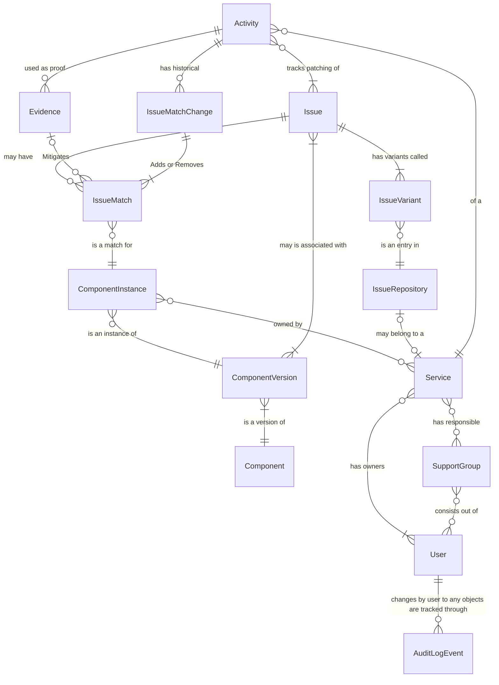
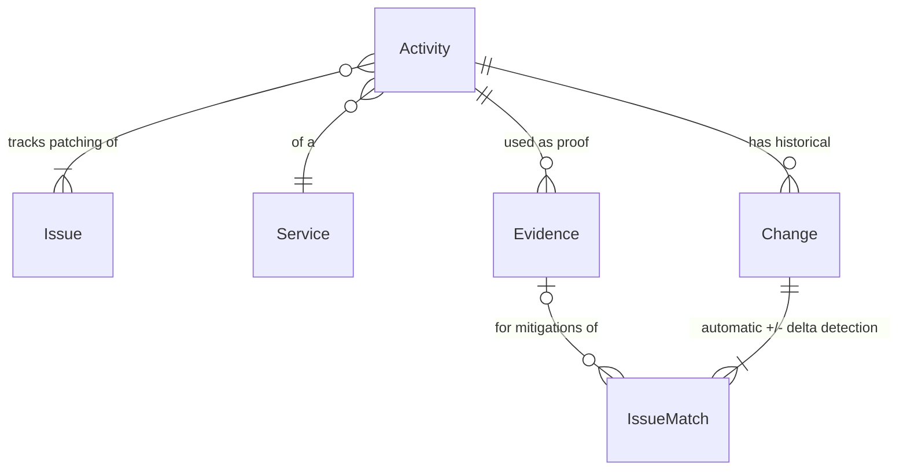
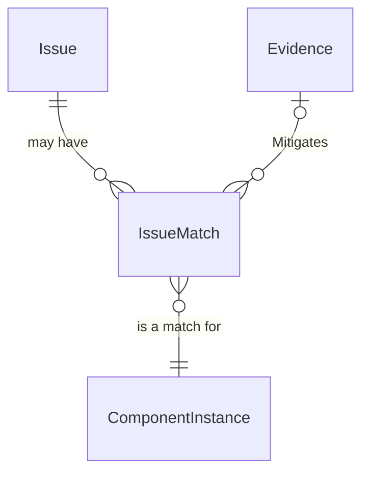
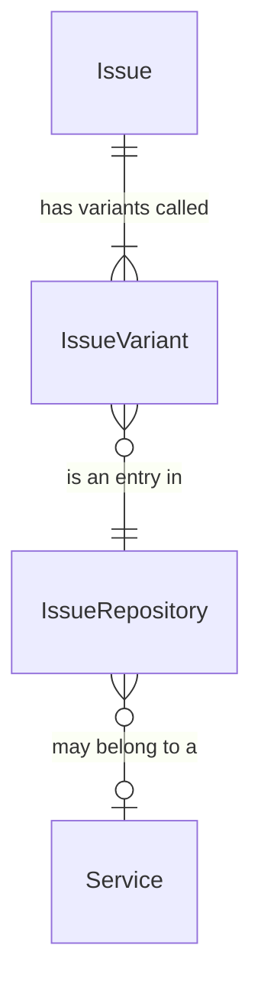
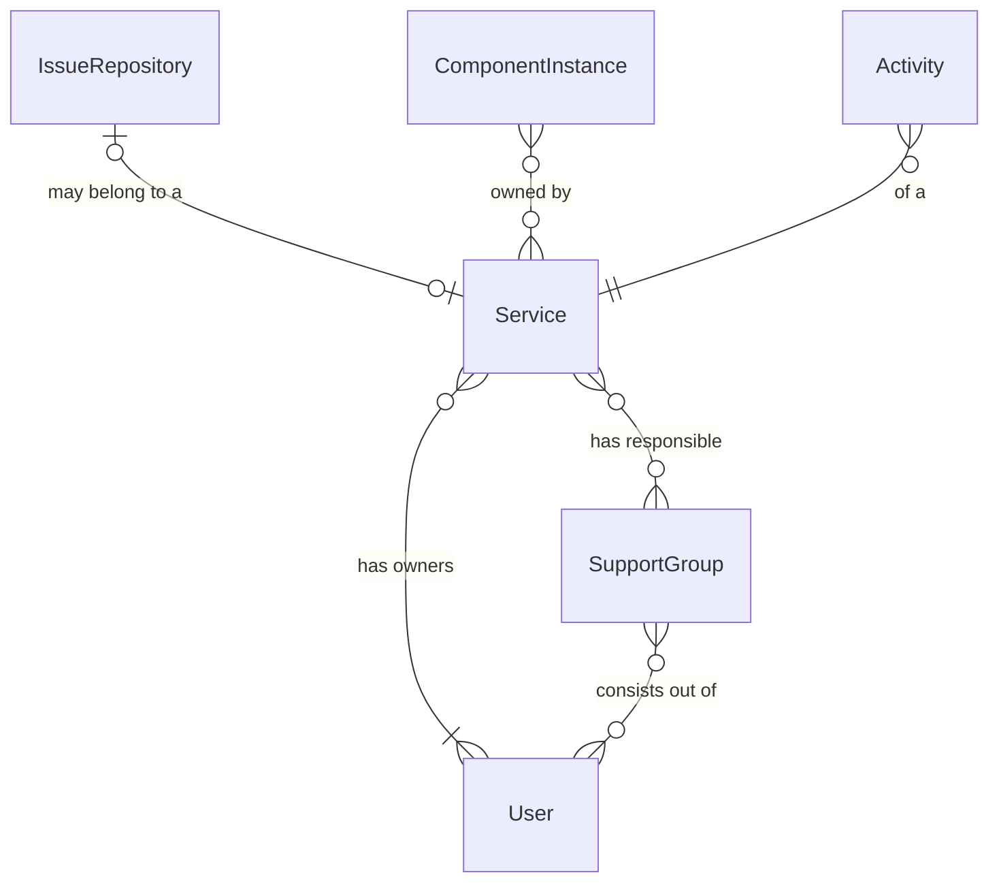

## Entities of Heureka

### Full Entity Relationship Diagram

## 

### The Activity

The Activity is the core of the patch Management Process tracking. Each activity is bound to a single service and
represents the patch activity for this service covering one or multiple Issues.

These two relations also represent the actual state of the patch activities and give through the transient relationships
insights to all required data such as affected components, instances, versions, and earliest target remediation date (date when activity needs to be finished).

In addition to that, there is a relationship to Evidence entities that are used to prove remediation of IssueMatches. Such as describing a configuration change applied which makes exploitation impossible.

To track the actual activity history there are automatically created/generated ActivityHistory records that store
all relevant historical data of the activity.

### The IssueMatch

An Issue basically is an equivalent entry of a CVE. It’s the absolute base unit describing a weakness or vulnerability.

An IssueMatch does connect this base unit with the actual component/resource (called ComponentInstance) on which the respective Issue got identified.

An IssueMatch is therefore the actual Issue that we want to fix/patch, as they are an instance of the baseUnit "Issue" deployed in the wilds, and therefore exposing a weakness/vulnerability.

Usually, an IssueMatch is created by a "Scanner" which is related to a "technical User" within the System, but a IssueMatch can also get created by a human for cases where a certain weakness/vulnerability and its patch management process needs to be tracked
without having any scanners/tools that are able to automatically detect them.

### The IssueVariant & IssueRepository

The BaseUnit Issue itself does not hold information about its severity, this is set by a so-called IssueVariant which is published by an IssueRepository.

The Issue Repositories have different priority weights and the lowest unit is the default issue variant, in our case the NVD of NIST / CVE of Mitre.

IssueVariants are created by the individual scanners that search for new issue variants in the respective repositories. An exception to this is the IssueVariants created for IssueRepositories that are connected to a service.

These IssueRepositories are custom Repositories that are created to adjust the severity of certain vulnerabilities/weaknesses or to create an issue variant for a not officially (through the other repositories) tracked issue.

### The Service

The Service is the central unit used by operational teams as these are the core units for which owners and support groups are assigned. They play a central role and are connected through theire relationships with all of the above described cases/relations.

